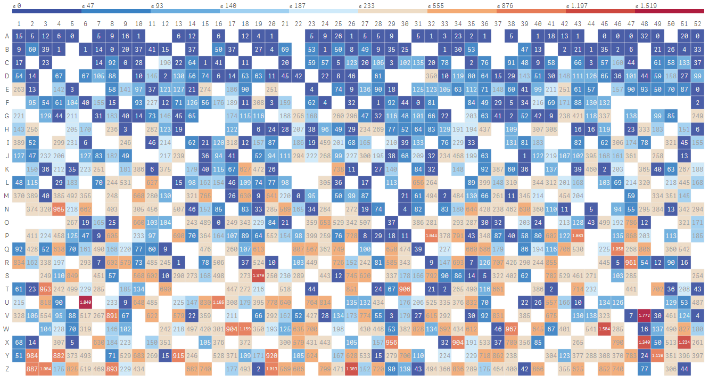

## Qlik Sense Extension 2 Dimensional Heatmap

This extension shows a matrix of colored tiles by two dimensions. The 1st dimension is used for the rows (variable, scrollbar if exceeds container element), 2nd dimension is used for the columns and should have a fixed maximum fitting to the container.

For best adoption use a numerical dimension for the 2nd dimension (columns) with a very short label like week (label: 01..53)

Based on: d3 day/hour heatmap for Qlik Sense
Source  : http://branch.qlik.com/projects/showthread.php?348-d3-day-hour-heatmap-for-Qlik-Sense

GitHub  : https://github.com/borodri/Sense_d3calendarheatmap

Author  : https://github.com/borodri

The extension and example app was created during the Qonnections 2015 Hackathon (Team Sixth Sense: Torben Seebach, Matthieu Burel, Ralf Becher)

After that I've added a bit more responsiveness for the grid layout, labels, font sizes and enable scrolling.

You can make a selection by one dimension by clicking on a dimension label (row or column) or a selection by two dimensions by clicking on a tile.

Also, you can use a lasso to make a two-dimensional selection:

## Additional Properties:

1. Color and Legend : color schema for measure visualization on tiles
2. Show Legend : show/hide legend
3. Dim1 Label Size (left) : max. amount characters shown of 1st dimension label (from left)
4. Dim2 Label Size (right/rotate left) : max. amount characters shown of 2nd dimension label (from right, or from left if rotated)
5. Rotate Dim2 Labels by -90° : rotate labels counterclockwise, better for more readable labels above small tiles
6. Max. Columns for Grid : expression to get max. amount of values of 2nd dimension to have a more stable grid layout
7. Least Tiles in Row : filter rows (1st dimension) with less than minimum amount of tiles (default=1; no filtering) 
8. Localized Number Format : use a localized number format for decimal and thousands separator
9. Show Numbers in Tiles: shows the measure number in each tile (only useful for small numbers, depending on tile sizes)
10. Show condition : QlikView-like show condition; useful if you have a measure or selection which doesn't gives you values. If condition <> 1 at least the labels of 1st and 2nd dimension are shown but no tiles.

## Sample Application:

Qlik Hackathon 2015 Start.qvf - Uses data from Medair to analyse Ebola Outbreak in Sierra Leone.

This app uses also Qlik Sense Extension VariableButton: https://github.com/asierfer/QlikSense-Ext-VariableButton

With class() function as measure dimension you can have a awesome fast backend calculated binning!

Rotation of Dim2 Labels and proper measure formattings:

## Author

**Ralf Becher**

+ [irregular.bi](http://irregular.bi)
* [twitter/irregularbi](http://twitter.com/irregularbi)
* [github.com/ralfbecher](http://github.com/ralfbecher)

## License

Copyright © 2015 Ralf Becher

Released under the MIT license.

***